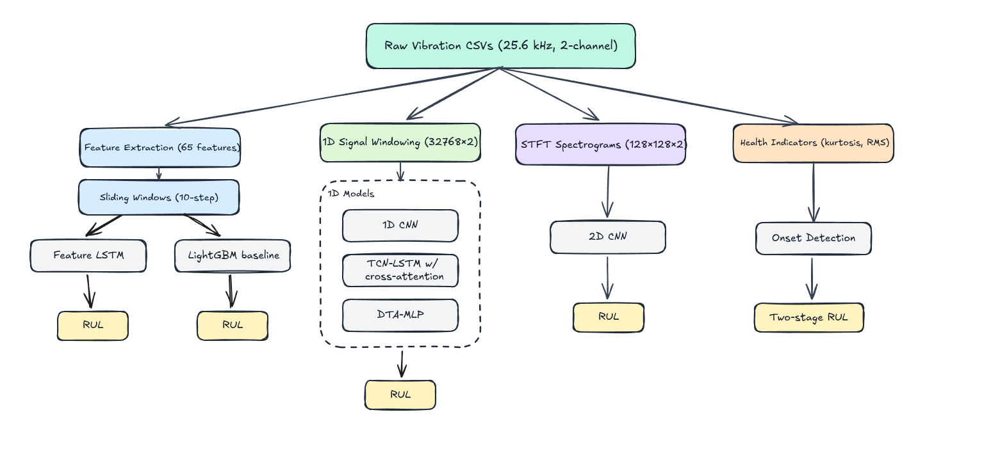

# XJTU-SY Bearing RUL Prediction

[](https://github.com/thfmn/xjtu-sy-bearing/actions/workflows/ci.yml)


A reproducible benchmark for **Remaining Useful Life (RUL)** prediction of rolling element bearings on the XJTU-SY dataset. Compares 6 models across 3 evaluation protocols with a two-stage onset detection pipeline, reproductions of two published methods ([Sun et al. 2024](https://pmc.ncbi.nlm.nih.gov/articles/PMC11481647/), [Jin et al. 2025](https://link.springer.com/article/10.1007/s43684-024-00088-4)), an interactive Gradio dashboard, and experiment tracking via MLflow and Vertex AI.

<!-- TODO: Add XJTU-SY test rig photo -->

## The Problem

Bearings are among the most critical, and most failure-prone, components in rotating machinery. A single unexpected bearing failure in a wind turbine, industrial pump, or rail axle can halt production for days and cost tens of thousands of dollars.

Traditional maintenance strategies are either **reactive** (fix it when it breaks, causing expensive downtime) or **time-based** (replace on a schedule, wasting perfectly good parts). **Predictive maintenance** uses sensor data to estimate how much useful life remains, enabling repairs at exactly the right time.

This project takes raw vibration signals from accelerometers mounted on bearings and predicts how many minutes of operation remain before failure, known as the **Remaining Useful Life**.

## Architecture Overview

<p align="center">
  
</p>

Four parallel input representations feed different model families, from gradient-boosted trees on hand-crafted features to deep learning on raw signals and spectrograms. A two-stage onset detection pipeline identifies the transition from healthy to degraded operation.

## Dataset

**XJTU-SY Bearing Dataset**, a widely-used benchmark for bearing prognostics research.

| Property | Value |
|---|---|
| Bearings | 15 (run-to-failure) |
| Operating conditions | 3 (35 Hz/12 kN, 37.5 Hz/11 kN, 40 Hz/10 kN) |
| Sampling rate | 25.6 kHz |
| Channels | 2 (horizontal + vertical vibration) |
| Total files | ~9,216 |

Each CSV file contains 32,768 samples (1.28 s recording) captured at regular intervals throughout a bearing's lifetime.

## Models

Six model architectures are benchmarked. Four are original designs; two reproduce published methods.

| Model | Input | Architecture | Source |
|---|---|---|---|
| **LightGBM** | 65 features | Gradient-boosted trees | Original |
| **Feature LSTM** | 65 features × 10 steps | Bidirectional LSTM + Dense | Original |
| **1D CNN** | 32768 × 2 raw signal | Conv1D → BatchNorm → GlobalAvgPool → Dense | Original |
| **CNN2D** | 128 × 128 × 2 spectrogram | 2D CNN with progressive downsampling | Original |
| **DTA-MLP** | 32768 × 2 raw signal | CNN encoder → Dual Temporal Attention → MLP | Reproduction of [Jin et al. 2025](https://link.springer.com/article/10.1007/s43684-024-00088-4) |
| **MDSCT** | 32768 × 2 raw signal | Multi-scale depthwise separable conv → ProbSparse attention → ECA | Reproduction of [Sun et al. 2024](https://pmc.ncbi.nlm.nih.gov/articles/PMC11481647/) |

> **Replication notes:**
> - **MDSCT** reproduces Sun et al. 2024 with parallel MDSC attention + PPSformer (ProbSparse self-attention) mixer blocks, ECA (Efficient Channel Attention), and per-sample min-max normalization. Architecture was corrected in v2 to faithfully match the paper's parallel topology (Fig. 7) and component details. Results are pending retraining.
> - **DTA-MLP** reproduces the Dual Temporal Attention mechanism and MLP head from Jin et al. 2025. The paper does not fully specify the CNN frontend architecture used to extract temporal features from raw signals; our implementation uses a standard 1D convolutional encoder.
> - **CNN1D, CNN2D, Feature LSTM, LightGBM** are original architectures designed for this project and are not reproductions of any published method.

<!-- TODO: Add model architecture diagrams -->

## Results

### Benchmark: 6 Models × 3 Evaluation Protocols

All metrics are **normalized RMSE** on the [0, 1] RUL scale. Each bearing's RUL is linearly normalized from 1.0 (start of life) to 0.0 (failure), making results comparable across bearings of different lifetimes and across published papers.

**Three evaluation protocols:**

| Protocol | Train | Test | Bearings | Samples | Source |
|---|---|---|---|---|---|
| **LOBO** | 4 bearings (same condition) | 1 held-out bearing | 15 (all conditions) | 9,216 | This work |
| **Jin** | Bearing1_4 + Bearing3_2 | Remaining 13 | 15 (all conditions) | 9,216 | [Jin et al. 2025](https://link.springer.com/article/10.1007/s43684-024-00088-4) |
| **Sun** | Bearing1_1 + Bearing1_2 + Bearing2_1 + Bearing2_2 | 6 test bearings | 10 (Cond 1-2 only) | 6,388 | [Sun et al. 2024](https://pmc.ncbi.nlm.nih.gov/articles/PMC11481647/) |

> **Protocol notes:**
> - **LOBO** (Leave-One-Bearing-Out) is a 15-fold cross-validation where each fold trains on 4 bearings from the same operating condition and tests on the held-out bearing. This is the strictest protocol: the model must generalize to a completely unseen bearing's degradation pattern.
> - **Jin split** is inferred from the results tables in Jin et al. 2025 which exclude Bearing1_4 and Bearing3_2 from test evaluation, suggesting these were used for training.
> - **Sun split**: Sun et al. 2024 do not describe their exact train/test split. We follow the standard XJTU-SY convention (train on Bearing1_1, Bearing1_2, Bearing2_1, Bearing2_2; test on the remaining 6 bearings from Conditions 1-2).

#### Aggregate Results (Normalized RMSE, lower is better)

| Model | LOBO (15-fold CV) | Jin (fixed split) | Sun (fixed split) |
|---|---|---|---|
| **Feature LSTM** | **0.160** | 0.302 | **0.156** |
| **MDSCT** | -- | -- | -- |
| **LightGBM** | 0.234 | 0.284 | 0.227 |
| **1D CNN** | 0.251 | 0.280 | 0.199 |
| **CNN2D** | 0.289 | **0.262** | 0.229 |
| **DTA-MLP** | 0.402 | 0.445 | 0.353 |

> **Note:** MDSCT architecture was corrected in v2 to faithfully match Sun et al. 2024 (parallel MDSC + PPSformer topology). Previous results are invalid. Retraining is pending.

<!-- TODO: Add bar chart comparing models across protocols -->

#### Comparison with Published Results

| Method | Source | RMSE | Bearings | Protocol |
|---|---|---|---|---|
| Bi-LSTM-Transformer | [Wang et al. 2025](https://www.mdpi.com/2076-3417/15/17/9529) | 0.056 | n/a | fixed split |
| MDSCT | [Sun et al. 2024](https://pmc.ncbi.nlm.nih.gov/articles/PMC11481647/) | 0.160 | 10 (Cond 1-2) | fixed split |
| DTA-MLP | [Jin et al. 2025](https://link.springer.com/article/10.1007/s43684-024-00088-4) | 0.169 | 13 (all cond) | fixed split |
| CNN-ResNet | [Jin et al. 2025](https://link.springer.com/article/10.1007/s43684-024-00088-4) | 0.173 | 13 (all cond) | fixed split |
| DCNN | [Sun et al. 2024](https://pmc.ncbi.nlm.nih.gov/articles/PMC11481647/) | 0.175 | 10 (Cond 1-2) | fixed split |
| TCN-SA | [Sun et al. 2024](https://pmc.ncbi.nlm.nih.gov/articles/PMC11481647/) | 0.194 | 10 (Cond 1-2) | fixed split |
| DAN | [Sun et al. 2024](https://pmc.ncbi.nlm.nih.gov/articles/PMC11481647/) | 0.268 | 10 (Cond 1-2) | fixed split |
| **Feature LSTM (ours)** | this work | **0.156** | **10 (Cond 1-2)** | **Sun split** |
| **MDSCT (ours)** | this work | -- | 10 (Cond 1-2) | Sun split |
| **Feature LSTM (ours)** | this work | **0.160** | **15 (all)** | **15-fold LOBO CV** |
| **MDSCT (ours)** | this work | -- | 15 (all) | 15-fold LOBO CV |

> **Comparison caveats:**
> - Published papers typically use fixed train/test splits that train on more data and test on fewer bearings. Our LOBO protocol is harder since each fold trains on only 4 bearings and must generalize to an unseen degradation pattern.
> - Sun et al. 2024 evaluates only on Conditions 1-2 (10 bearings). Our LOBO includes the challenging Condition 3 bearings (Bearing3_1: 2,538 files, Bearing3_2: 2,496 files).
> - Our Feature LSTM uses per-bearing z-score normalization (first 20% of each bearing as healthy baseline), which is a form of test-time adaptation, a legitimate but methodologically different approach compared to end-to-end models that learn features from raw signals.
> - Our MDSCT implementation (v2) has been corrected to faithfully match the paper architecture. Results are pending retraining.
> - Results use a single random seed. Variance across seeds is not reported.

<!-- TODO: Add per-bearing RMSE heatmap across models and conditions -->

#### Per-Bearing Results (LOBO, Normalized RMSE)

| Bearing | Cond | Files | Feature LSTM | MDSCT | LightGBM | 1D CNN | CNN2D | DTA-MLP |
|---|---|---|---|---|---|---|---|---|
| Bearing1_1 | 1 | 123 | 0.127 | -- | 0.166 | 0.141 | 0.482 | 0.440 |
| Bearing1_2 | 1 | 161 | 0.219 | -- | 0.231 | 0.204 | 0.367 | 0.477 |
| Bearing1_3 | 1 | 158 | 0.090 | -- | 0.201 | 0.207 | 0.337 | 0.542 |
| Bearing1_4 | 1 | 122 | 0.149 | -- | 0.294 | 0.272 | 0.303 | 0.298 |
| Bearing1_5 | 1 | 52 | 0.120 | -- | 0.215 | 0.219 | 0.271 | 0.303 |
| Bearing2_1 | 2 | 491 | 0.188 | -- | 0.272 | 0.280 | 0.258 | 0.289 |
| Bearing2_2 | 2 | 161 | 0.227 | -- | 0.149 | 0.210 | 0.149 | 0.417 |
| Bearing2_3 | 2 | 533 | 0.189 | -- | 0.094 | 0.068 | 0.129 | 0.515 |
| Bearing2_4 | 2 | 42 | 0.067 | -- | 0.183 | 0.175 | 0.194 | 0.355 |
| Bearing2_5 | 2 | 339 | 0.143 | -- | 0.291 | 0.194 | 0.138 | 0.342 |
| Bearing3_1 | 3 | 2538 | 0.175 | -- | 0.274 | 0.289 | 0.312 | 0.370 |
| Bearing3_2 | 3 | 2496 | 0.162 | -- | 0.271 | 0.290 | 0.347 | 0.535 |
| Bearing3_3 | 3 | 371 | 0.219 | -- | 0.284 | 0.502 | 0.310 | 0.352 |
| Bearing3_4 | 3 | 1515 | 0.184 | -- | 0.288 | 0.224 | 0.244 | 0.520 |
| Bearing3_5 | 3 | 114 | 0.141 | -- | 0.292 | 0.491 | 0.502 | 0.281 |
| **Mean** | | | **0.160** | -- | **0.234** | **0.251** | **0.289** | **0.402** |

### Onset Detection

Two-stage pipeline that first identifies when degradation begins, then predicts RUL only in the degraded region.

| Component | Method | Performance |
|---|---|---|
| Statistical detectors | Kurtosis threshold, RMS threshold, Kurtosis CUSUM, RMS CUSUM | 15/15 bearings labeled |
| LSTM classifier | 8-feature z-score input (5,793 params) | F1 = 0.844 ± 0.243 (15-fold LOBO CV) |
| Manual labels | Expert-verified onset indices | 11 high, 2 medium, 2 low confidence |

## Interactive Dashboard

A Gradio dashboard (`app.py`) provides interactive visualization of all results:

```bash
uv run python app.py
# Opens at http://localhost:7860
```

**Tabs:**
- **EDA:** Degradation trends with onset markers, feature distributions
- **Model Results:** Cross-model comparison (LightGBM + DL), feature importance, training curves
- **Predictions:** Per-bearing RUL curves, residual analysis
- **Onset Detection:** Health indicator explorer, classifier performance, detector comparison
- **Audio Analysis:** Vibration signals sonified to audio (healthy → degrading → failed)

## Getting Started

### Prerequisites

- **Python 3.11+**
- **[uv](https://docs.astral.sh/uv/)** package manager
- **GPU** (optional): only needed for deep learning model training (scripts 05, 09, 10-12)
- **GCP credentials** (optional): only needed for scripts 01-02 (data upload/preprocessing via GCS)

### 1. Clone and install

```bash
git clone https://github.com/thfmn/xjtu-sy-bearing.git
cd xjtu-sy-bearing
uv sync
```

### 2. Get the dataset

Download the [XJTU-SY Bearing Dataset](https://biaowang.tech/xjtu-sy/) and extract it to:

```
assets/Data/XJTU-SY_Bearing_Datasets/
├── 35Hz12kN/     # Condition 1 (5 bearings)
├── 37.5Hz11kN/   # Condition 2 (5 bearings)
└── 40Hz10kN/     # Condition 3 (5 bearings)
```

### 3. Configure environment variables (optional)

GCP-related scripts (01, 02) require a `.env` file. Copy the example and fill in your values:

```bash
cp .env.example .env
# Edit .env with your GCP project details
```

For local-only work (scripts 03+), no `.env` is needed.

### 4. Run tests

```bash
uv run pytest tests/    # 587 tests
```

### 5. Launch the dashboard

```bash
uv run python app.py
# Opens at http://localhost:7860
```

> **Note:** The dashboard requires pre-computed output files. See [Reproducing Results](#reproducing-results) for how to generate them.

### Quick commands

```bash
# Train a model (e.g., 1D CNN baseline, fold 0)
python scripts/05_train_dl_models.py --model cnn1d_baseline --folds 0

# Train LightGBM (full-life normalized)
python scripts/10_train_lgbm.py --config configs/twostage_lgbm_fulllife.yaml

# Train Feature LSTM
python scripts/11_train_feature_lstm.py --config configs/fulllife_feature_lstm.yaml

# Run full benchmark (all models × all protocols)
python scripts/12_run_benchmark.py

# Launch experiment tracking UI
bash scripts/mlflow_server.sh
```

## Reproducing Results

The `outputs/` directory is gitignored (it contains ~2 GB of generated artifacts). After [setting up the project](#getting-started), run the pipeline scripts in order to populate it. The dashboard (`app.py`) depends on these outputs.

### 1. Run the pipeline

Each script is numbered by execution order. Steps 1-2 are GCP-specific (optional for local work); start from step 3 for local-only reproduction.

```bash
# Step 3: Extract 65 time/frequency-domain features from raw CSVs
#   → outputs/features/features_v2.csv  (9,216 rows)
python scripts/03_extract_features.py

# Step 3b: Enrich with temporal features (lags, rolling stats, diff)
#   → outputs/features/features_v3.csv  (9,216 rows × 145 cols)
python scripts/03b_enrich_temporal_features.py

# Step 4: Generate STFT spectrograms for 2D CNN models
#   → outputs/spectrograms/  (128×128×2 .npy files, Hive-partitioned)
python scripts/04_generate_spectrograms.py

# Step 5: Train deep learning models (1D CNN, CNN2D, DTA-MLP, MDSCT)
#   → outputs/models/  (saved Keras models)
#   → outputs/evaluation/  (*_fold_results.csv, predictions/, history/)
python scripts/05_train_dl_models.py --model cnn1d_baseline --folds 0

# Step 6: Evaluate and aggregate DL model results
#   → outputs/evaluation/dl_model_summary.csv
python scripts/06_evaluate_dl_models.py

# Step 7: Generate sonified audio from vibration signals (optional)
#   → outputs/audio/  (.wav files for dashboard Audio tab)
python scripts/07_create_audio.py

# Step 8: Generate onset detection labels with statistical detectors
#   → outputs/onset/onset_labels_auto.csv  (15 rows, one per bearing)
python scripts/08_generate_onset_labels.py

# Step 9: Train LSTM onset classifier
#   → outputs/models/onset_classifier_cv_results.csv
python scripts/09_train_onset_classifier.py

# Step 10: Train LightGBM
#   → outputs/benchmark/lgbm_*/
python scripts/10_train_lgbm.py --config configs/twostage_lgbm_fulllife.yaml

# Step 11: Train Feature LSTM
#   → outputs/benchmark/feature_lstm_*/
python scripts/11_train_feature_lstm.py --config configs/fulllife_feature_lstm.yaml

# Step 12: Run full benchmark (orchestrates all models × protocols)
python scripts/12_run_benchmark.py
```

**LightGBM evaluation** (model comparison, feature importance, per-bearing metrics) is generated by running `notebooks/30_evaluation.ipynb`.

### 2. Required outputs for the dashboard

The dashboard **requires** these files to start (will error without them):

| File | Generated by |
|---|---|
| `outputs/features/features_v2.csv` | `scripts/03_extract_features.py` |
| `outputs/evaluation/model_comparison.csv` | `notebooks/30_evaluation.ipynb` |
| `outputs/evaluation/lgbm_feature_importance.csv` | `notebooks/30_evaluation.ipynb` |
| `outputs/evaluation/lgbm_per_bearing.csv` | `notebooks/30_evaluation.ipynb` |

All other output files are optional. The dashboard gracefully degrades when they are missing.

## Project Structure

```
├── app.py                    # Gradio interactive dashboard
├── app/                      # Dashboard tab modules
│   ├── data.py               #   Data loading and caching
│   └── plots.py              #   Plotly visualization helpers
├── configs/                  # YAML training configurations
│   ├── onset_labels.yaml     #   Manual onset labels (15 bearings)
│   ├── twostage_*.yaml       #   Two-stage pipeline configs
│   ├── fulllife_*.yaml       #   Full-life normalized configs
│   └── benchmark_*.yaml      #   Benchmark experiment configs
├── notebooks/                # EDA, training, and evaluation notebooks
│   ├── 01-03_eda_*.ipynb     #   Exploratory data analysis
│   ├── 20-24_model_*.ipynb   #   Model development
│   ├── 30_evaluation.ipynb   #   Cross-model comparison
│   └── 40-41_onset_*.ipynb   #   Onset detection evaluation
├── scripts/                  # Pipeline scripts (numbered by stage)
│   ├── 01-02_*.py            #   GCS upload and preprocessing
│   ├── 03_extract_features.py
│   ├── 03b_enrich_temporal_features.py
│   ├── 04_generate_spectrograms.py
│   ├── 05_train_dl_models.py #   Train CNN1D, CNN2D, DTA-MLP, MDSCT
│   ├── 06_evaluate_dl_models.py
│   ├── 07_create_audio.py
│   ├── 08_generate_onset_labels.py
│   ├── 09_train_onset_classifier.py
│   ├── 10_train_lgbm.py      #   LightGBM training
│   ├── 11_train_feature_lstm.py  # Feature LSTM training
│   ├── 12_run_benchmark.py   #   Full benchmark orchestrator
│   ├── 13_sync_vertex_to_mlflow.py  # Sync Vertex AI → MLflow
│   └── submit_vertex_jobs.py #   Submit GPU jobs to Vertex AI
├── src/
│   ├── data/                 # Data loading, windowing, augmentation, RUL labels
│   │   ├── dataset_builders.py  # Dataset construction for each model type
│   │   ├── feature_windows.py   # Sliding window features for LSTM
│   │   └── rul_labels.py        # RUL normalization strategies
│   ├── features/             # 65-feature extraction (time + frequency domain)
│   │   └── temporal.py       #   Temporal feature enrichment
│   ├── models/               # Model registry and architectures
│   │   ├── baselines/        #   LightGBM, 1D CNN, Feature LSTM
│   │   ├── cnn2d/            #   Spectrogram-based 2D CNN
│   │   ├── dta_mlp/          #   DTA-MLP (Jin et al. 2025 reproduction)
│   │   ├── mdsct/            #   MDSCT (Sun et al. 2024 reproduction)
│   │   ├── pattern1/         #   TCN-Transformer variants
│   │   └── registry.py       #   Unified model registry
│   ├── onset/                # Degradation onset detection pipeline
│   │   ├── detectors.py      #   4 statistical detectors + ensemble
│   │   ├── health_indicators.py  # Kurtosis/RMS health indicator computation
│   │   ├── labels.py         #   Onset label loading and management
│   │   ├── models.py         #   LSTM onset classifier
│   │   └── pipeline.py       #   End-to-end detection pipeline
│   ├── training/             # Config, cross-validation, metrics
│   │   ├── cv.py             #   LOBO, Jin, Sun split implementations
│   │   └── metrics.py        #   RMSE, MAE, PHM08 score
│   └── utils/                # Experiment tracking, helpers
├── tests/                    # pytest suite (587 tests)
└── pyproject.toml
```

## Experiment Tracking

Dual-backend setup for local development and cloud reproducibility:

- **MLflow** (local): `bash scripts/mlflow_server.sh` launches the UI at `localhost:5000`
- **Vertex AI Experiments** (cloud): automatic logging when running on GCP with `--tracking vertex`

## Tech Stack

- **ML Frameworks:** TensorFlow/Keras, LightGBM
- **Signal Processing:** SciPy, PyWavelets
- **Data:** Pandas, NumPy, BigQuery
- **Infrastructure:** GCS, Vertex AI, MLflow
- **Package Management:** uv
- **Visualization:** Plotly, Gradio (interactive dashboard)
